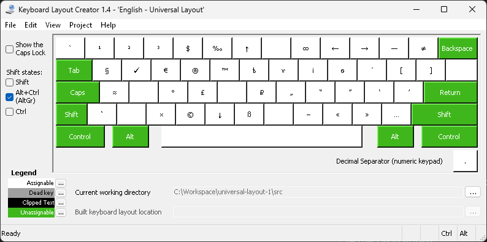
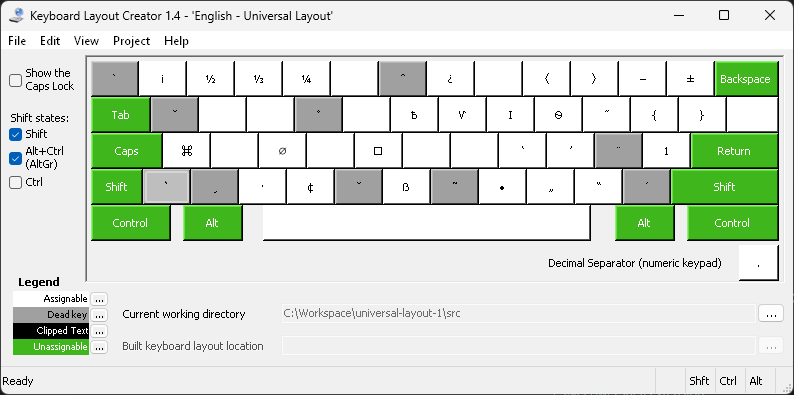
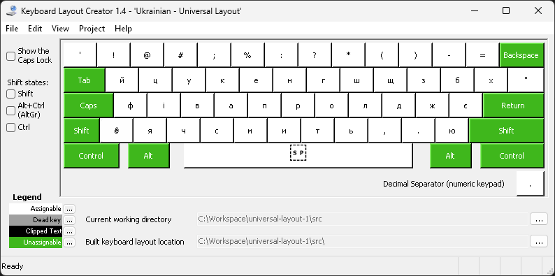
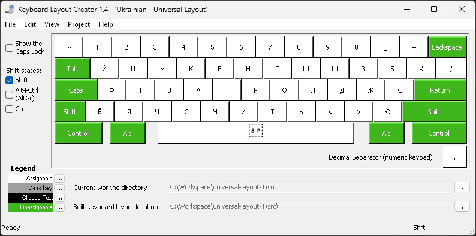
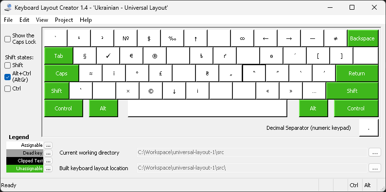
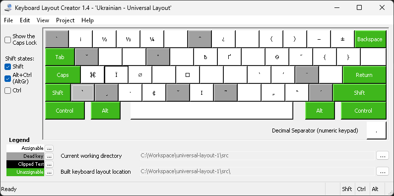

Английская, русская и украинская раскладки для Windows, повторяющие по возможности [Universal Layout для MacOS от tonsky](https://github.com/tonsky/Universal-Layout).

# Английская раскладка

## shift

## alt 

## shift+alt

# Русская раскладка

## shift

## alt 

## shift+alt

# Украинская раскладка

## shift

## alt 

## shift+alt

